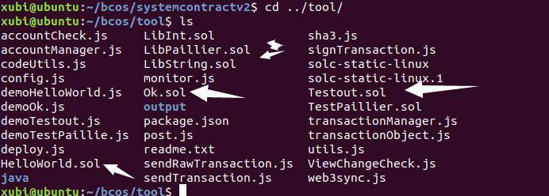

**Build bcos on docker**
====================
Based on ubuntu18.10 OS

<br><br>

## **Let’s start!**
### Install Depends before play
```bash
	sudo apt-get install git
	sudoapt-get install -y nodejs 
	sudoapt-get install -y npm
	sudo npm install -g cnpm --registry=https://registry.npm.taobao.org
	sudo cnpm install -g babel-cli babel-preset-es2017
	echo '{ "presets": ["es2017"] }' > ~/.babelrc	sudo npm install babel-cli
	sudo apt-get install cmake
	wget https://github.com/ethereum/solidity/releases/download/v0.4.13/solc-static-linux
	sudo cp solc-static-linux  /usr/bin/solc
	sudo chmod +x /usr/bin/solc
	sudo cnpm install -g ethereum-console
```
<br>
## Install Docker
You can Visit  https://docs.docker.com/install/linux/docker-ce/ubuntu/
<br>
①use packages repository
<br>
```bash
	$sudo apt-get install \
	apt-transport-https \
	ca-certificates \
	curl \
	gnupg-agent \
	software-properties-common
```
②Add Docker’s official GPG key
```bash
	$ curl -fsSL https://download.docker.com/linux/ubuntu/gpg | sudo apt-key add –
```
③by searching for the last 8 characters of the fingerprint.
```bash
	$sudo apt-key fingerprint 0EBFCD88      
```
④softwware update
```bash
	$sudo apt-get update
	$apt list –upgradable
```
⑤set up the stable repository
```bash
	$sudo add-apt-repository \
    "deb [arch=amd64] https://download.docker.com/linux/ubuntu \
    (lsb_release -cs) \
    stable"
```
<br>
##### ⑥INSTALL NOW
```bash
	$sudo apt-get install docker-ce docker-ce-cli containerd.io
```
⑦Add your user to the docker group
```bash	
	$ sudo groupadd docker
	$ sudo usermod -aG docker $USER
```
⑧PowerBoot
```bash	
	$sudo systemctl enable docker     
```
Check docker status, like this:
 (if you see anything like “Permission denied”,  maybe you need log back in)
<br><br>
<br>
Please refer to the official website for more information.
<br>
## Configuring Bcos
Cloning file
```bash	
	$git clone https://github.com/bcosorg/bcos
```
<br><br>
```bash
	$cd bcos/docker
```
Set genesis node config file into node-0
```bash	
	$./scripts/genConfig.sh
```

launch docker container
```bash
	$ ./scripts/start_bcos_docker.sh $PWD/node-0
```
<br><br>
 Correct state:

```bash
	$ cd ../systemcontractv2
	$ cnpm install
	(sudo chown -R $USER:$(id -gn $USER) /home/xubi/.config)
```
You can input again to check
<br><br>
 modification bcos/docker/node-0/config.js  "Port": 35500”
Of course, you can open the file to modify
```bash
	$ sed -i 's/127.0.0.1:8545/127.0.0.1:35500/' config.js
	$ babel-node deploy.js
```
<br><br>
<br><br>
best way is copy those into txt file or other
then alter bcos/docker/node-0/config.json systemproxyaddress to last step SystemProxy contract address
```bash
	$ sed -i 's/"systemproxyaddress":"0x0"/"systemproxyaddress":"0xff27dc5cc5144c626b9fdc26b2f292d9df062470"/' ../docker/node-0/config.json
```
Check last step
```bash
	$ cat ../docker/node-0/config.json | grep systemproxyaddress
```
<br><br>
restart node-0
```bash
	$ docker restart $(docker ps -a | grep bcos-node-0 | awk 'NR==1{print$1}')
```
write Genesis Node into contract
```bash
	$ babel-node tool.js NodeAction registerNode ../docker/node-0/node.json
```
<br><br>
We can see $docker ps -a
<br><br>

## New prot into
```bash
	$ cd bcos/docker
```
-1.genConfig.sh are addition to genesis node and genesis node configuration paths
Focus on genesis node create a new node
```bash
	$ ./scripts/genConfig.sh 1 node-0
```
<br><br>
<br><br>
```bash
	$ cd bcos/systemcontractv2
```
-2.write this message(new node[node-1]) into contract
```bash
	$ babel-node tool.js NodeAction registerNode ../docker/node-1/node.json 
```
<br><br>
-3.start new node (full path)
```bash
	$ cd ../docker & ./script/start_bcos_docker.sh $PWD/node-0
```
<br><br>
If you want more, Repeat this (-1、-2、-3) 
### working state
block growth indicates that the network is working properly
```bash
	$ cd ../systemcontractv2
	$ babel-node monitor.js
```
end of the environment configuration

## Deployment contract
contract file in bcos/tool/
<br><br>
Solidity toplink: https://solidity-cn.readthedocs.io/zh/develop/
you can see HelloWorld.sol
(bcos/tool/HelloWorld.sol)
we need to change it for use
because of the default grammar is out of date
we need to change 
```bash
	contract HelloWorld{
	    string name;
	    constructor() public{
	       name="Hi,Welcome!";
	    }
	    function get() public view returns(string memory){
		return name;
	    }
	    function set(string memory n) public{
		name=n;
	    }
	}
```
```bash
	$ cd bcos/tool/
	$ cnpm install
```
Deployment contract, config.js *prot and ip* must be the same as bcos/docker/node-0/config.js 
```bash
	$ babel-node deploy.sol HelloWorld
```
<br><br>
if want to deployment other contract, do it like this(is one way)
*ps:* Hope this call you when you want quickStart.(maybe not well)

Summarizes the train of thought
==============================
First, docker is a convenient container that reduces many of the problems that arise in development testing and implementation deployment depending on the environment.While building bcos on docker can achieve a single machine with multiple nodes and only consume few resources. 
The second，bcos is an open source block chain project, it is relatively easy to build, as you understand the construction of the distributed system (such as DFS, KASS, Andrew). The structures, bcos more nodes are relatively easy to understand, the system proxy address, dfsNode, dfsGroup, networkid, since is a cluster, the conditions of the nodes need to be unified, to limit their position in the cluster.
The last, if you want to understand it carefully    DO THIS [The white paper](https://github.com/bcosorg/bcos/blob/master/doc/manual/manual.md)
*Maybe I'll do it more than once*
<br>
## Problems That You May Have
Q：
If you see your port is busy or other you can (sudo apt-get install net-tools  & netstat -ap | grep $you port and kill -9 PID) 


Q：
sudo yum install -y openssl openssl-devel
chmod +x scripts/install_deps.sh
./scripts/install_deps.sh

